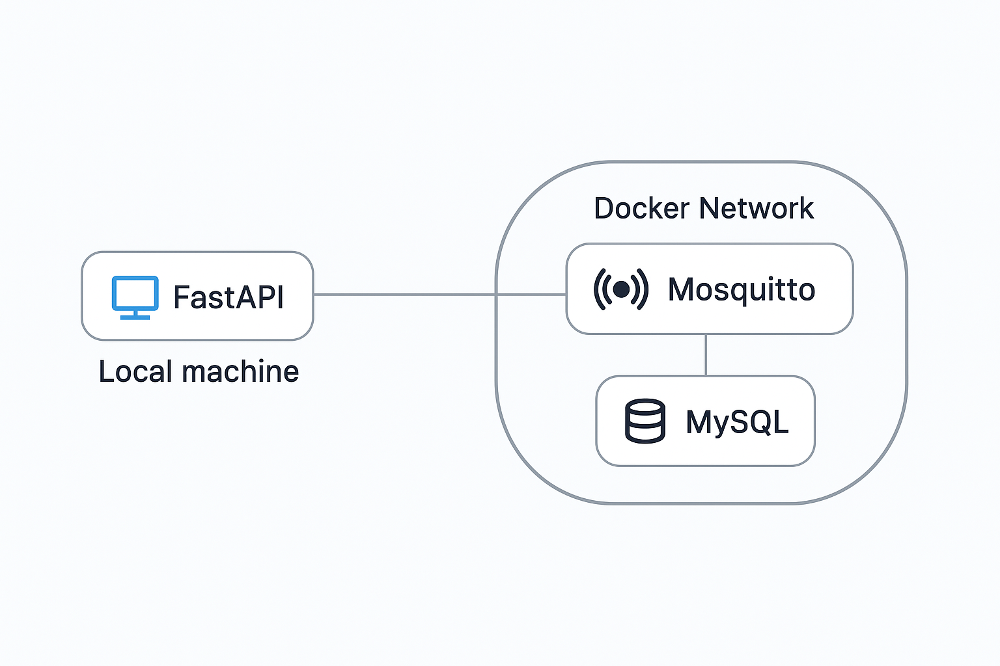

## 목차

### 🦺 [개요](#🦺-개요) | 🎓 [사용 기술](#🎓-사용-기술) | 🏭 [프로젝트 소개](#🏭-프로젝트-소개) |  📈 [시스템 아키텍쳐](#📈-시스템-아키텍쳐) | 📓 [디렉토리 구조](#📓-디렉토리-구조) |

## 🦺 개요

이 프로젝트는 **Docker**, **MQTT(Eclipse Mosquitto)**, 그리고 **FastAPI**를 활용한 시스템 구조를 실습하고 검증해 보기 위해 진행한 개인 프로젝트입니다.

학습 목적의 토이 프로젝트이며, 실서비스 목적이 아닙니다.

### 개발기간: **2025년 4월 28일 ~ 5월 9일**

## 🎓 사용 기술

### INFRA

 

### BACKEND

  


### Database


---

## 🏭 프로젝트 소개

**Docker**, **MQTT(Eclipse Mosquitto)**, **FastAPI**, **MySQL**을 활용한 메세지 송수신 시스템

### 작동 흐름

1. **Docker 컨테이너 설정**
     - `MySQL`
     - `Mosquitto`

2. **FastAPI 서버 실행**
   - MQTT 메시지 **구독(Subscriber)**
   - 실시간으로 메시지 수신
   - 수신한 MQTT 메시지 처리 
   - **MySQL** 에 저장

3. **MQTT 메시지 발행**
   - Docker의 `Mosquitto` 컨테이너에서 **Publisher** 역할을 하여 메시지 발행
   - 메시지는 `Mosquitto` 브로커를 통해 FastAPI 서버로 전송

4. **메시지 수신**
   - FastAPI 서버에서 `Mosquitto`에서 발행된 메시지 수신
   - 메시지를 실시간으로 로그로 출력
   - **MySQL**에 메세지 저장

## 📈 시스템 아키텍쳐




## 📓 디렉토리 구조

```

    ├── app
    │   ├── database.py             # 데이터베이스 관련 로직
    │   ├── main.py                 # 애플리케이션 진입점 및 실행 파일
    │   ├── models.py               # 데이터 모델 정의
    │   └── mqtt_client.py          # MQTT 클라이언트 연결 및 통신
    |
    │
    ├── exec
    │   ├── porting_manual.md       # 포팅 매뉴얼
    │   └── sys_architecture.png    # 시스템 아키텍처
    │
    └──
        ├── .env                    # 환경 설정 파일
        └── requirements.txt        # Python 의존성 패키지 목록


```